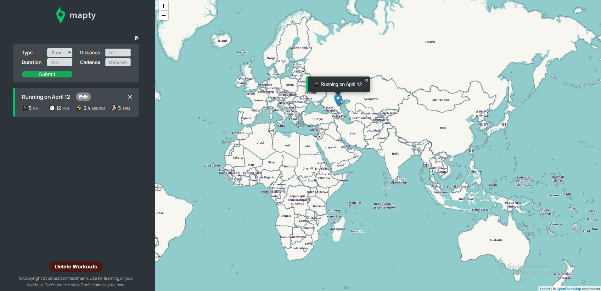

# Mapty web API project

This is a solution to the [Mapty web API project froms Jona's Schmedtmann JavaScript course](

## Table of contents

- [Overview](#overview)
  - [The challenge](#the-challenge)
  - [Screenshot](#screenshot)
  - [Links](#links)
  - [Built with](#built-with)
- [Author](#author)

## Overview

A Map API based on the leadlet API that stores data about gymnastic activities in the local storage.

### The challenge

Users should be able to:

- Create new listings of activities
- See the exact location with a marker popup
- The app retains all data after page reload and
- Ability to delete all listings or individually
- Ability to edit listings
- Simple browser alert if input data is invalid

### Screenshot

### Links

- Solution URL: https://github.com/paul-dont/mapty-web-app
- Live Site URL: https://keen-churros-aa0cb3.netlify.app

### Built with

- Semantic HTML5 markup
- CSS custom properties
- Vanilla JavaScript

### Future Additions

- Proper alert popups
- Ability to draw lines on the map and different shapes
- Map zoom out on page load to contain all stored locations
- Better backend data management

## Author

- Jonas Schmedtmann - https://twitter.com/jonasschmedtman
